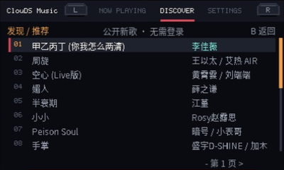
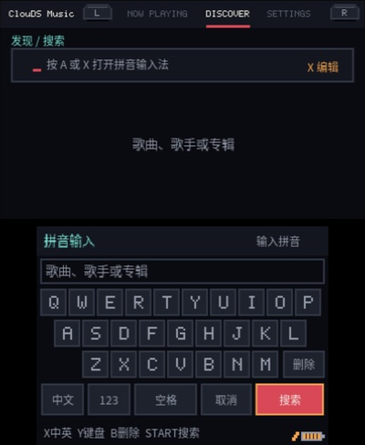

# ClouDS Music

ClouDS Music 是一款面向 Nintendo 3DS 的原生网易云音乐 homebrew 客户端，提供
像素风双屏界面、在线播放、搜索、歌词和 SD 卡缓存。

> 本项目不是网易云音乐官方客户端。服务使用非公开接口，未来可能因接口变化而暂时
> 不可用；项目不会绕过 VIP、地区、购买或下架限制。

## 界面预览

公开新歌列表：



搜索与本地拼音输入：



## 核心功能

- 浏览公开新歌、每日推荐以及自己创建或收藏的歌单
- 使用网易云音乐手机 App 扫码登录，并支持安全退出
- 搜索歌曲、歌手和专辑，内置本地拼音输入法
- 播放标准音质 MP3，支持播放队列、播放模式、自动续播和进度拖动
- 显示专辑封面、同步歌词和四种像素风沉浸歌词效果
- 将音频、封面和歌词缓存到 SD 卡，已缓存歌曲可离线播放
- 中英文界面、缓存空间管理和可选调试日志
- 以 Old 3DS/2DS 的资源限制为设计基线，同时支持 New 3DS 系列

## 下载与安装

请从项目的 [GitHub Releases](https://github.com/cadl/ClouDS-Music/releases)
下载官方版本，并使用 `SHA256SUMS` 核对文件。

Homebrew Launcher 用户将 `ClouDS-Music.3dsx` 放到：

```text
/3ds/ClouDS-Music/ClouDS-Music.3dsx
```

已经安装 CFW 的主机也可以安装发行包中的 `ClouDS-Music.cia`。3DSX 和 CIA 共用
`/3ds/ClouDS-Music` 数据目录。

发行包不会包含 Nintendo DSP 固件。音频环境需要主机提供 `hb:ndsp`，或由机主从
自己的 3DS 提取 `/3ds/dspfirm.cdc`；请勿下载、分发或提交他人的固件。

## 基础操作

| 按键 | 功能 |
| --- | --- |
| 十字键 / Circle Pad | 移动选择、滚动列表 |
| `A` | 确认、打开或播放 |
| `B` | 返回或取消当前任务 |
| `L / R` | 切换 Tab 或翻页 |
| `X / Y` | 执行当前页面显示的扩展操作 |
| `SELECT` | 切换上下屏焦点或播放模式 |
| `START` | 3 秒内再次按下以退出 |
| 触摸下屏 | 控制播放、进度和播放列表 |

每个页面都会在下屏显示当前可用的按键提示，具体操作以屏幕提示为准。

## 构建

克隆仓库并初始化子模块：

```sh
git clone --recursive https://github.com/cadl/ClouDS-Music.git
cd ClouDS-Music
```

无需 devkitPro 即可运行主机测试：

```sh
make host-test
```

已配置 devkitARM 时运行 `make -j2`。否则可以使用仓库固定的 Docker 构建环境：

```sh
make emulator-build
make cia-build
```

macOS 上可使用仓库固定版本的 Azahar：

```sh
make azahar-install
make run
```

## 使用说明与限制

- 首次联网前请确认 3DS 的日期和时间正确，否则 HTTPS 证书校验可能失败。
- 登录凭据保存在 `/3ds/ClouDS-Music/auth.bin`，请勿公开、分享或附加到 Issue。
- 缓存、设置、播放列表和可选诊断日志均保存在 `/3ds/ClouDS-Music`。
- Azahar 适合验证界面和基础功能，但不能替代 Old 3DS 内存、DSP、睡眠、真实 Wi-Fi
  和 SD 卡性能测试。
- 更完整的使用问题见 [AI 支持 FAQ](docs/AI_SUPPORT_FAQ.md)，真机检查见
  [硬件测试清单](docs/HARDWARE_TEST.md)。

## 参与项目

提交修改前请阅读 [贡献指南](CONTRIBUTING.md)。安全问题请按照
[安全策略](SECURITY.md) 私下报告，不要在公开 Issue 中发送 Cookie、`MUSIC_U`、
`auth.bin`、完整媒体 URL 或 Nintendo 固件。

## 许可

项目自有代码和文档使用 [MIT License](LICENSE)。第三方代码、字体、字典和证书保留
各自许可证，详见 [THIRD_PARTY_NOTICES.md](THIRD_PARTY_NOTICES.md)。项目名称和官方
身份说明见 [TRADEMARKS.md](TRADEMARKS.md)。

官方版本免费发布。本项目与网易云音乐或 Nintendo 没有隶属或背书关系，使用时仍须
遵守适用法律、网易云音乐服务条款和音乐版权限制。
